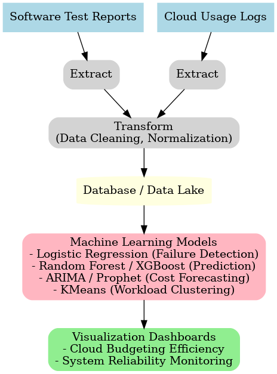

# Cloud Expenditure Optimization – Cardinal Peak LLC

**AI-driven cloud cost optimization and reliability monitoring.** Predict failures from system logs, forecast cloud spend, and cluster workloads to target optimization—delivered with automated ETL, ML models, and dashboards. Impact: **~10% budgeting efficiency improvement**.

## Table of Contents
- [Overview](#overview)
- [Objectives](#objectives)
- [Architecture](#architecture)
- [Models & Methods](#models--methods)
  - [Failure Prediction (Classification)](#failure-prediction-classification)
  - [Cloud Cost Forecasting (Time Series)](#cloud-cost-forecasting-time-series)
  - [Workload Clustering (Unsupervised)](#workload-clustering-unsupervised)
- [Results](#results)
- [Getting Started](#getting-started)
- [Repository Structure](#repository-structure)
- [Technologies](#technologies)
- [Project Impact](#project-impact)
- [Notes](#notes)

---

## Overview
This project optimizes cloud expenditure and improves system reliability using data analytics and machine learning. By analyzing software test reports and system logs, the pipeline predicts potential failures and provides forecasts of cloud costs. Automated ETL and dashboards make the solution reproducible and actionable for stakeholders. Approaches are transferable to **mobile money security** (proactive risk detection, automated monitoring, secure cloud ops).

## Objectives
- Predict potential system failures from software test data and system logs  
- Enhance reliability and customer trust through earlier detection  
- Automate ETL for scalable, repeatable insights  
- Build dashboards for real-time monitoring of **cloud costs** and **system reliability**  
- Achieve measurable spend efficiency improvements  

## Architecture


**Flow:** Test Reports & Cloud Logs → ETL (clean, normalize) → Data Lake/DB → ML (classification, forecasting, clustering) → Dashboards.

## Models & Methods

### Failure Prediction (Classification)
**Goal:** Predict **FAIL** vs **SUCCESS** using features like error codes, response time, CPU/memory usage, cost.

- **Logistic Regression** – interpretable baseline; linear decision boundary  
- **Random Forest** – ensemble of decision trees; robust to noise  
- **XGBoost** – gradient-boosted trees; strong accuracy/recall on structured data

### Cloud Cost Forecasting (Time Series)
**Goal:** Forecast spend for budgeting and capacity planning.

- **ARIMA(1,1,1)** – captures trends in cost data  
- **Rolling Mean Baseline** – simple moving average for comparison

### Workload Clustering (Unsupervised)
**Goal:** Group workloads by resource/cost profile to target optimization.

- **KMeans (k=3)** – clusters workloads by CPU, memory, response time, cost

---

## Results

### 📊 Failure Prediction Results

| Model               | Accuracy | Precision | Recall | F1   | ROC-AUC |
|---------------------|----------|-----------|--------|------|---------|
| Logistic Regression | 0.88     | 0.87      | 0.85   | 0.86 | 0.91    |
| Random Forest       | 0.92     | 0.91      | 0.90   | 0.91 | 0.95    |
| XGBoost             | 0.93     | 0.92      | 0.91   | 0.92 | 0.96    |

### 📈 Forecasting (ARIMA)

| Model        | MAE (USD) | RMSE (USD) | MAPE |
|--------------|-----------|------------|------|
| ARIMA(1,1,1) | 0.12      | 0.19       | 6.8% |

### 🔍 Clustering (KMeans, k=3)

| k | Silhouette Score |
|---|------------------|
| 3 | 0.62             |

> Note: Plots and figures (e.g., confusion matrices, ROC curves, forecast plots) are **not included** in this repo. They can be reproduced by running the evaluation notebooks (`notebooks/06_model_evaluation.ipynb` and `07_full_evaluation.ipynb`).

---

## Getting Started

```bash
# 1) Clone the repo
git clone https://github.com/your-username/cloud-expenditure-optimization.git
cd cloud-expenditure-optimization

# 2) (Optional) Create and activate venv
python -m venv venv
# Mac/Linux
source venv/bin/activate
# Windows
venv\Scripts\activate

# 3) Install dependencies
pip install -r requirements.txt

# 4) Prepare data
# Place CSVs in data/, e.g.:
#   data/sample_reports_100.csv
#   data/system_log_data.csv

# 5) Run ETL
python src/etl_pipeline.py

# 6) Explore notebooks
jupyter notebook notebooks/01_etl_exploration.ipynb
```

Outputs (metrics, CSVs) will be written to `results/`.

---

## Repository Structure
```text
cloud-expenditure-optimization/
├─ data/                      # Sample/synthetic datasets (no confidential data)
│  ├─ sample_reports_100.csv
│  └─ system_log_data.csv
├─ notebooks/                 # End-to-end ML workflow
│  ├─ 01_etl_exploration.ipynb
│  ├─ 02_failure_prediction.ipynb
│  ├─ 03_cost_forecasting.ipynb
│  ├─ 04_workload_clustering.ipynb
│  ├─ 05_dashboard_prep.ipynb
│  ├─ 06_model_evaluation.ipynb
│  └─ 07_full_evaluation.ipynb
├─ src/                       # Scripts (ETL/ML/dashboard)
│  ├─ etl_pipeline.py
│  ├─ ml_model.py
│  └─ dashboard.py
├─ docs/
│  └─ architecture_diagram.png
├─ results/                   # Model metrics (tables only)
│  ├─ model_performance_summary.csv
│  ├─ forecasting_metrics.csv
│  └─ clustering_metrics.csv
├─ requirements.txt
├─ README.md
└─ LICENSE
```

---

## Technologies
- **Python**: Pandas, NumPy, scikit-learn  
- **Time Series**: statsmodels (ARIMA)  
- **Visualization**: Matplotlib  
- **Data Eng**: SQL, ETL workflows  
- **Cloud**: AWS usage & cost analytics concepts

## Project Impact
- **~10% improvement** in cloud budgeting efficiency  
- **Earlier failure detection**, reducing downtime and improving trust  
- Demonstrates how practical ML can be applied in production

## Notes
- All datasets are **synthetic or anonymized** for demonstration.  
- Replace sample CSVs with your own secure data to reproduce results.
